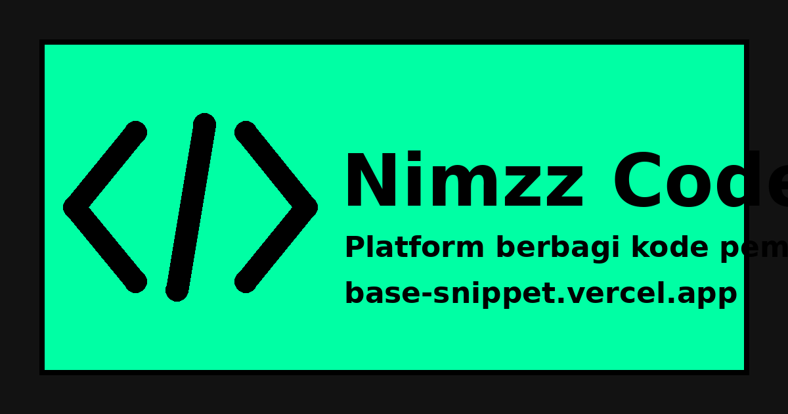

<p align="center">
  
</p>

# ⚡ Nimzz Code

Platform berbagi snippet, script otomasi, modul bot, dan project code untuk developer. Dibuat dengan gaya **Neo-Brutalism** yang responsif dan mobile-first, dengan panel admin untuk mengelola semuanya dari HP.

- Demo: https://base-snippet.vercel.app
- Versi: 2.0.0
- Framework: Next.js 14.2 (App Router) + TypeScript

---

## 📚 Daftar Isi

1. [Fitur](#-fitur)
2. [Tech Stack](#️-tech-stack)
3. [Instalasi Lokal](#-instalasi-lokal)
4. [Environment Variables](#️-environment-variables)
5. [Deploy ke Vercel + Supabase](#-deploy-ke-vercel--supabase)
6. [Cara Kerja Login Admin](#-cara-kerja-login-admin)
7. [Share, Thumbnail, dan OG Image](#-share-thumbnail-dan-og-image)
8. [API Publik](#-api-publik)
9. [Upload Gambar](#-upload-gambar)
10. [Struktur Direktori](#-struktur-direktori)
11. [Catatan Perubahan](#-catatan-perubahan)
12. [Troubleshooting](#-troubleshooting)

---

## 🚀 Fitur

### Snippet & Viewer
- **Viewer ala VS Code (Dark+)**: syntax highlighting, nomor baris, tab file, breadcrumb, status bar (baris/kolom, spasi, UTF-8, bahasa).
- **Aksi cepat**: Salin Kode, Download File (ekstensi mengikuti bahasa), View Raw, Word Wrap, Embed, dan Share.
- **Kartu snippet** dengan thumbnail, preview kode yang terpotong halus, tag, jumlah views, dan tombol Preview / Detail / Salin.
- **Quick Preview**: modal yang dirender lewat portal ke `<body>`, tampil sebagai bottom sheet di HP dan dialog di desktop.
- **Pencarian & filter** berdasarkan kata kunci, kategori, bahasa, dan tag.
- **Kategori dinamis** yang bisa ditambah atau dihapus admin.
- **Request kode**: pengunjung bisa mengirim permintaan modul, admin melihatnya di panel.

### Share
- Tombol **Share** memakai Web Share API. Teks yang dibagikan berisi judul, **kategori**, bahasa, deskripsi singkat, lalu URL, jadi bukan URL saja.
- Fallback otomatis ke clipboard bila browser tidak mendukung Web Share API.
- Link yang dibagikan punya preview (Open Graph + Twitter Card) berisi judul, kategori, bahasa, dan gambar.

### Panel Admin
- Ringkasan (total snippet, views, request, kategori), kelola kode, kategori, dan request.
- **Kustomisasi profil owner**: nama, username, bio, avatar, banner, dan tautan sosial (WhatsApp, GitHub, Telegram, TikTok). Perubahan yang belum disimpan tidak ditimpa oleh sinkronisasi otomatis.
- Mode maintenance dengan `MaintenanceGuard`.
- Notifikasi Telegram untuk request dan kode baru (opsional).

### Halaman Owner (`/owner`)
Banner dan avatar kustom, badge Platform Owner & Verified Creator, bio, tech stack, serta kartu tautan resmi.

### Keamanan
- Login username + password tanpa OAuth pihak ketiga.
- Batas **5 percobaan gagal**, lalu lockout **15 menit** berdasarkan kombinasi IP dan Device ID.
- Password di-hash dengan **bcrypt**, dibandingkan secara constant-time.
- Session berupa token **HMAC SHA-256** di cookie `httpOnly`.
- Semua endpoint tulis (`POST/PUT/DELETE`) memeriksa session admin di server.
- `PUT /api/codes/[slug]` hanya menerima field `title`, `description`, `category`, `language`, `tags`, `thumbnail`, dan `code`. Field seperti `id`, `slug`, `views`, dan author tidak bisa ditimpa dari luar.
- Input dibersihkan dari tag HTML berbahaya (`lib/security.ts`).

---

## 🛠️ Tech Stack

| Bagian | Teknologi |
| :--- | :--- |
| Framework | Next.js 14.2 (App Router), React, TypeScript |
| Styling | CSS kustom Neo-Brutalism (`app/globals.css`) |
| Data | Supabase (REST) di produksi, file JSON di `data/` saat lokal |
| Highlight | `react-syntax-highlighter` (Prism, vscDarkPlus) |
| Keamanan | `bcryptjs`, HMAC SHA-256, rate limiter IP + Device ID |
| Upload gambar | AceImg (tanpa API key) |
| Ikon | FontAwesome |
| Deploy | Vercel |

---

## 📦 Instalasi Lokal

```bash
git clone https://github.com/NimzzAI/Base-snippet.git
cd share-code-website
cp .env.example .env.local
npm install
npm run dev
```

Buka http://localhost:3000. Tanpa konfigurasi Supabase, data disimpan di folder `data/`.

Build produksi:

```bash
npm run build
npm start
```

### Di Android (Termux)
```bash
pkg install nodejs git
git clone <url-repo-kamu> && cd Base-snippet
cp .env.example .env.local
npm install
npm run dev
```

---

## ⚙️ Environment Variables

| Variabel | Wajib | Fungsi | Contoh |
| :--- | :---: | :--- | :--- |
| `NEXT_PUBLIC_SITE_URL` | Ya | URL situs, dipakai untuk metadata, OG image, sitemap, dan link share | `https://base-snippet.vercel.app` |
| `ADMIN_USERNAME` | Ya | Username login admin | `admin` |
| `ADMIN_PASSWORD` | Ya* | Password admin (di-hash saat server start) | `ganti-ini` |
| `ADMIN_PASSWORD_HASH` | Opsional | Hash bcrypt siap pakai, menggantikan `ADMIN_PASSWORD` | `$2a$10$...` |
| `ADMIN_SECRET` | Ya | Kunci penanda tangan cookie session. Acak dan panjang | `string-acak-panjang` |
| `INTERNAL_TEST_SECRET` | Opsional | Token untuk `/api/internal-test` | `token-rahasia` |
| `NEXT_PUBLIC_SUPABASE_URL` | Di Vercel | URL project Supabase | `https://xxxx.supabase.co` |
| `SUPABASE_SERVICE_ROLE_KEY` | Di Vercel | Service role key, hanya dipakai di server | `eyJ...` |
| `ACEIMG_API_URL` | Opsional | Ganti endpoint upload gambar | `https://api.aceimg.com/api/upload` |
| `TELEGRAM_BOT_TOKEN` | Opsional | Token bot untuk notifikasi | `123:ABC...` |
| `TELEGRAM_OWNER_CHAT_ID` | Opsional | Chat ID penerima notifikasi | `123456789` |
| `TELEGRAM_WEBHOOK_SECRET` | Opsional | Secret webhook Telegram | `string-bebas` |

\* Wajib salah satu: `ADMIN_PASSWORD` atau `ADMIN_PASSWORD_HASH`.

> ⚠️ Jangan memakai nilai default (`admin123`, secret bawaan) di produksi. Ganti `ADMIN_PASSWORD` dan `ADMIN_SECRET`.

---

## 🚢 Deploy ke Vercel + Supabase

Filesystem Vercel read-only, jadi **Supabase wajib** agar data (kode, profil owner, kategori, request) bisa disimpan.

1. Buat project di Supabase, buka **SQL Editor**, lalu jalankan isi `supabase.sql` sekali.
2. Di Vercel: **Project → Settings → Environment Variables**, isi semua variabel pada tabel di atas, terutama `NEXT_PUBLIC_SUPABASE_URL`, `SUPABASE_SERVICE_ROLE_KEY`, `ADMIN_USERNAME`, `ADMIN_PASSWORD`, `ADMIN_SECRET`, dan `NEXT_PUBLIC_SITE_URL`.
3. **Redeploy**, karena variabel baru hanya terbaca pada build berikutnya.
4. Login di `/admin/login`, lalu atur profil di **Panel → Kustom Avatar & Banner**.

Setup Telegram bot ada di [DEPLOY.md](./DEPLOY.md).

---

## 🔐 Cara Kerja Login Admin

1. `POST /api/admin/login` memverifikasi kredensial, lalu mengirim cookie `httpOnly` berisi token HMAC.
2. `GET /api/admin/session` memeriksa cookie dan mengembalikan `authenticated`.
3. `AuthProvider` (`lib/auth-context.tsx`) memanggil endpoint session saat aplikasi dibuka.

Aturan di sisi client supaya tidak ada "tiba-tiba disuruh login":

- Selama pengecekan session berjalan, `loading = true`. Halaman admin (`dashboard`, `publish`, `edit`, `settings`) hanya menampilkan skeleton dan **tidak** redirect atau menampilkan peringatan sebelum server menjawab.
- Hanya jawaban resmi server yang dapat membuat status menjadi logout. Error jaringan atau 5xx tidak mengubah status login.
- Ada penanda ringan `nimzz_admin_hint` di localStorage untuk mengurangi kedipan UI. Penanda ini hanya untuk tampilan. Hak akses tetap diputuskan server lewat cookie.

### Sinkronisasi profil owner
- Profil diambil dari `/api/admin/profile` secara berkala.
- State hanya diperbarui bila isi profil di server **benar-benar berubah**.
- Form di dashboard diisi satu kali dari data server, tidak ditimpa oleh polling, sehingga isian yang belum disimpan tidak hilang.
- Bila server gagal dihubungi, tampilan tetap memakai profil terakhir dan tidak kembali ke default.

---

## 🖼️ Share, Thumbnail, dan OG Image

### Thumbnail
- Diisi di form **Publish** / **Edit** (URL gambar atau upload).
- Tampil di kartu snippet, halaman detail (di bagian paling atas), dan Quick Preview.
- Hanya alamat `http(s)://` atau path lokal yang diterima (`validThumbnail` di `lib/code-utils.ts`). Gambar yang gagal dimuat otomatis disembunyikan.

### Metadata link share
Metadata halaman detail dibuat di `app/code/[slug]/layout.tsx` (server component), karena `page.tsx` adalah client component dan tidak bisa mengekspor `generateMetadata`. Isinya:

- **Judul**: `Judul Kode • Kategori`
- **Deskripsi**: `Kategori | Bahasa | deskripsi singkat`
- **Gambar utama (`og:image`)**: thumbnail snippet. Bila kosong, memakai gambar otomatis `/api/og/[slug]`.
- **Gambar cadangan**: `/og-image.png` milik situs, ditempatkan setelah gambar utama.

### Gambar OG otomatis
`GET /api/og/[slug]` membuat gambar 1200×630 berisi kategori, bahasa, judul, beberapa baris awal kode, nama situs, dan nama author. Dipakai bila snippet tidak punya thumbnail.

> Preview di WhatsApp dan Telegram di-cache lama oleh platformnya. Saat menguji, pakai snippet baru atau tambahkan parameter berbeda di URL.

### Teks Share
Dibuat oleh `buildShareText` di `lib/code-utils.ts`:

```text
📦 Judul Kode
📁 Kategori: Tools  •  💻 javascript

Deskripsi singkat...

Lihat kodenya di Nimzz Code:
https://base-snippet.vercel.app/code/slug-kode
```

---

## 🔌 API Publik

Dokumentasi interaktif tersedia di `/api-docs`.

| Method | Endpoint | Keterangan |
| :--- | :--- | :--- |
| GET | `/api/v1/snippets` | Daftar snippet. Query: `search`, `category`, `language`, `tag`, `limit` (1-50), `offset` |
| GET | `/api/v1/snippets/:slug` | Detail snippet beserta kode |
| GET | `/api/v1/snippets/:slug/raw` | Kode mentah. Tambah `download=1` untuk mengunduh |
| GET | `/api/og/:slug` | Gambar OG otomatis (PNG 1200×630) |
| GET | `/embed/:slug` | Widget iframe untuk disematkan |
| GET | `/sitemap.xml`, `/robots.txt` | Dibuat otomatis dari data |

Endpoint admin (butuh cookie session):

| Method | Endpoint | Keterangan |
| :--- | :--- | :--- |
| POST | `/api/codes` | Publish snippet baru |
| PUT | `/api/codes/:slug` | Ubah snippet (field terbatas, lihat bagian Keamanan) |
| DELETE | `/api/codes/:slug` | Hapus snippet |
| GET/POST | `/api/admin/profile` | Baca (publik) dan simpan (admin) profil owner |
| POST | `/api/upload` | Upload gambar |

---

## 📤 Upload Gambar

Avatar, banner, dan thumbnail diunggah lewat AceImg, gratis tanpa API key. Hanya PNG dan JPG, dan gambar otomatis dikecilkan di browser sebelum dikirim dengan batas sisi terpanjang berikut:

| Jenis | Maks. sisi | Maks. ukuran |
| :--- | :---: | :---: |
| Avatar | 1024px | 3 MB |
| Thumbnail | 1920px | 5 MB |
| Banner | 2400px | 5 MB |

Pengaturan ada di `lib/upload-client.ts` (`LIMITS`).

---

## 📁 Struktur Direktori

```text
├── app/
│   ├── admin/login/            # Login administrator
│   ├── api/
│   │   ├── admin/              # login, logout, session, profile
│   │   ├── categories/         # CRUD kategori
│   │   ├── codes/              # CRUD snippet (+ [slug])
│   │   ├── og/[slug]/          # Gambar OG otomatis
│   │   ├── requests/           # Request kode dari pengunjung
│   │   ├── telegram/           # Notifikasi dan webhook Telegram
│   │   ├── upload/             # Upload gambar (AceImg)
│   │   ├── v1/snippets/        # API publik
│   │   └── internal-test/      # Test runner internal
│   ├── api-docs/               # Dokumentasi API interaktif
│   ├── category/[name]/        # Daftar kode per kategori
│   ├── code/[slug]/            # Detail kode
│   │   ├── layout.tsx          # Metadata share (OG/Twitter)
│   │   └── page.tsx            # Halaman detail
│   ├── dashboard/              # Panel admin
│   ├── edit/[id]/              # Edit snippet
│   ├── embed/[slug]/           # Widget embed
│   ├── owner/                  # Profil developer
│   ├── profile/[username]/     # Profil publik + metadata
│   ├── publish/                # Form publish snippet
│   ├── request/                # Form request kode
│   ├── search/                 # Pencarian
│   ├── settings/               # Pengaturan admin
│   ├── globals.css             # Seluruh styling
│   ├── layout.tsx              # Root layout + metadata situs
│   └── page.tsx                # Beranda
├── components/
│   ├── AppShell.tsx            # Wrapper layout
│   ├── CodeCard.tsx            # Kartu snippet
│   ├── CodePreviewModal.tsx    # Quick Preview (portal)
│   ├── CustomSelect.tsx
│   ├── MaintenanceGuard.tsx
│   ├── MobileTabBar.tsx        # Tab bar bawah (mobile)
│   ├── Sidebar.tsx
│   ├── ToastProvider.tsx
│   ├── Topbar.tsx
│   └── VSCodeViewer.tsx        # Viewer ala VS Code
├── lib/
│   ├── auth-context.tsx        # Auth + profil di sisi client
│   ├── auth-server.ts          # Session, bcrypt, HMAC
│   ├── code-utils.ts           # Helper share, thumbnail, ekstensi file
│   ├── config.ts               # Konfigurasi terpusat
│   ├── json-db.ts, store.ts    # Akses data (Supabase / JSON lokal)
│   ├── public-api.ts           # Format respons API publik
│   ├── security.ts             # Sanitasi dan rate limit
│   ├── upload-client.ts, aceimg.ts
│   └── types.ts
├── public/                     # Ikon, og-image.png, manifest
├── data/                       # Data lokal (hanya saat tanpa Supabase)
├── supabase.sql                # Skema tabel Supabase
├── settings.js                 # Konfigurasi runtime
├── DEPLOY.md                   # Panduan Telegram bot
└── .env.example
```

---

## 📝 Catatan Perubahan

### Perbaikan terbaru
- **Profil owner tidak lagi kembali ke default** saat belum disimpan. Form tidak ditimpa polling, dan state hanya berubah bila data server berubah.
- **Admin tidak lagi tiba-tiba diminta login** saat refresh. Halaman admin menunggu pengecekan session selesai, dan error jaringan tidak dianggap logout.
- **Thumbnail tampil** di kartu, detail (paling atas), dan Quick Preview.
- **Preview kode dirapikan**: modal lewat portal, bottom sheet di HP, preview kartu dengan efek memudar.
- **Share menyertakan kategori**, bahasa, dan deskripsi, bukan hanya URL.
- **Metadata share berfungsi** lewat `layout.tsx` (sebelumnya `metadata.ts` tidak pernah dibaca Next.js), dengan OG image otomatis.
- **Avatar diperbesar** di dashboard (112px) dan halaman owner (132px).
- **Ekstensi file download** benar untuk semua bahasa.
- **Tampilan lebih HD**: `public/og-image.png` dibuat ulang (2400×1260, PNG asli; sebelumnya JPEG 736×414 yang salah ekstensi), batas upload dinaikkan (avatar 1024px, thumbnail 1920px, banner 2400px, kualitas 0.95), `next/image` memakai kualitas 90-95 dengan format AVIF/WebP, dan ikon 192/512 ditambahkan ke metadata.
- **`PUT /api/codes/[slug]`** hanya menerima field yang boleh diubah.

---

## 🧯 Troubleshooting

| Masalah | Penyebab umum | Solusi |
| :--- | :--- | :--- |
| Simpan profil gagal atau data kembali awal di Vercel | Supabase belum diisi | Isi `NEXT_PUBLIC_SUPABASE_URL` dan `SUPABASE_SERVICE_ROLE_KEY`, jalankan `supabase.sql`, redeploy |
| Preview link tidak berubah di WhatsApp | Cache platform | Tes dengan snippet baru, atau tunggu cache habis |
| Thumbnail tidak tampil | URL bukan `http(s)` atau gambar diblokir hotlink | Upload lewat tombol upload di form |
| Upload gagal | Format selain PNG/JPG atau AceImg sedang down | Pakai PNG/JPG, atau ganti `ACEIMG_API_URL` |
| Gambar `/api/og/...` kosong | Slug tidak ditemukan | Pastikan slug ada di data |

---

## 📄 Lisensi

Dikelola oleh **Nimzz**. Dibuat untuk komunitas developer Indonesia.